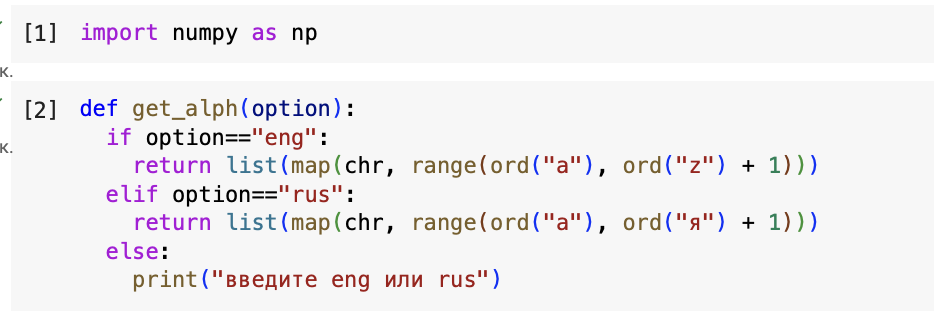
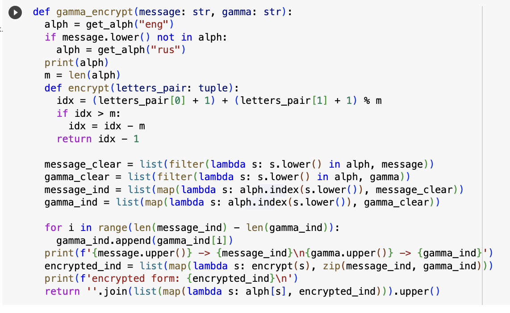
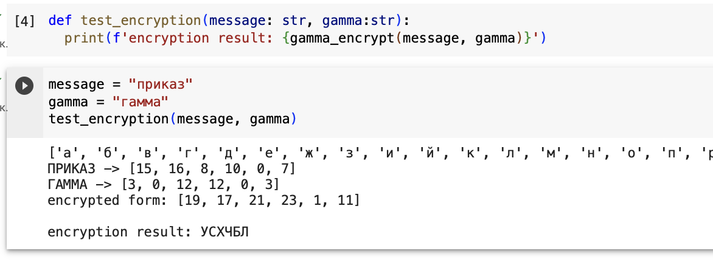

---
## Front matter
lang: ru-RU
title: Отчет по лабораторной работе №3.
subtitle: Шифрование гаммированием

author: |
	Alexander O. Vorobyov\inst{1}
	
institute: |
	\inst{1}RUDN University, Moscow, Russian Federation
	
date: 12 October, 2023

## Formatting
toc: false
slide_level: 2
theme: metropolis
header-includes: 
 - \metroset{progressbar=frametitle,sectionpage=progressbar,numbering=fraction}
 - '\makeatletter'
 - '\beamer@ignorenonframefalse'
 - '\makeatother'
aspectratio: 43
section-titles: true
---

# Прагматика выполнения

## Прагматика выполнения

Лабораторная работа выполняется для получения знаний о шифровании гаммированием. 

# Цель работы

## Цель работы

Целью данной работы является приобретение практических навыков реализации Шифрования гаммированием.

# Задачи выполнения 

## Задачи выполнения  

1. На языке Python реализовал выбор алфавита и его генерацию.  
{ #fig:001 width=70% } 
	
## Задачи выполнения  

2. Далее реализовал алгоритм шифрования гаммированием. 

{ #fig:002 width=70% }   

## Задачи выполнения  

2. Ввел данные для проверки. 

{ #fig:003 width=70% }   

# Результаты выполнения 

## Результаты выполнения 

В результате проделанной работы я приобрел практические навыки шифрования гаммированием.

